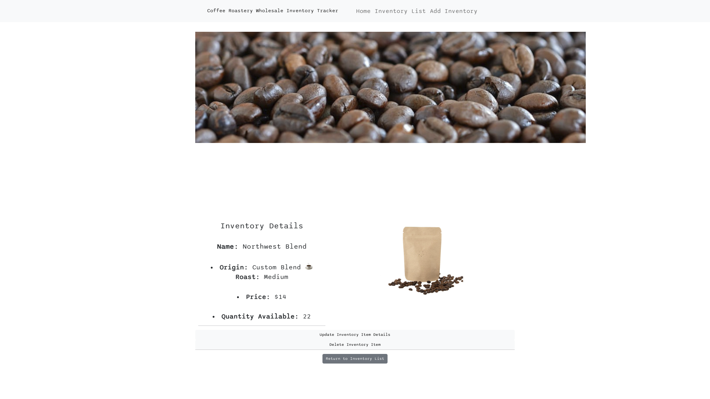
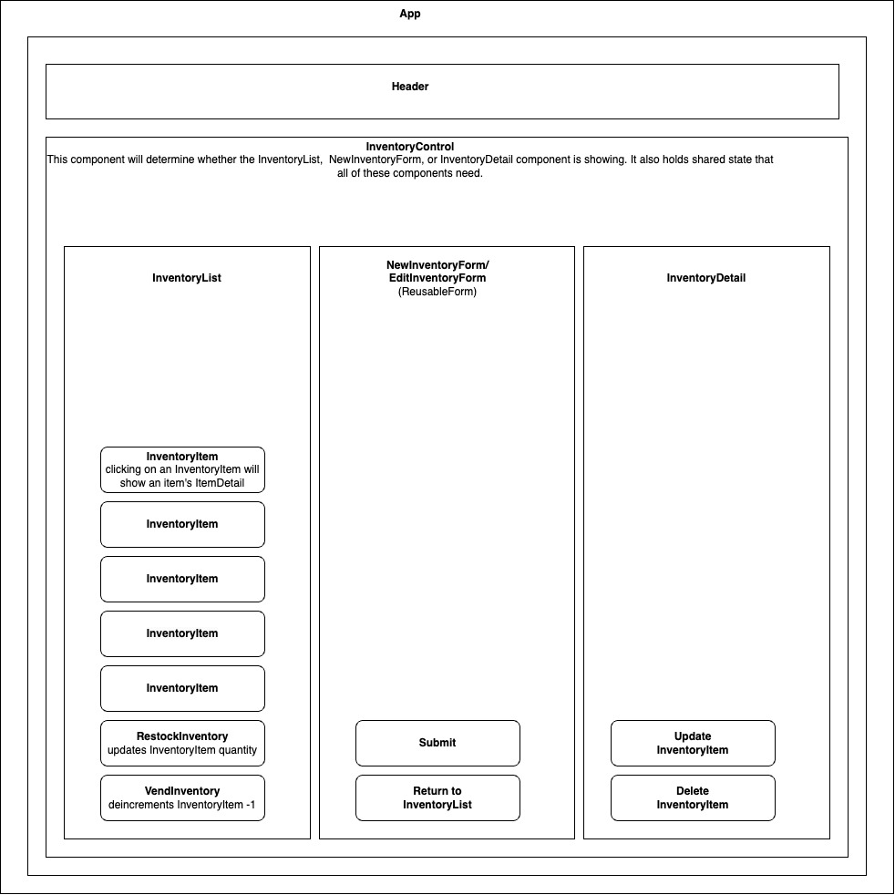

# ☕️Coffee Roaster Inventory Tracker☕️

#### By Eliot Gronstal 4.21.23

#### _A React application that tracks inventory for a local business that includes CRUD functionality. Made for Independent Code Review at Epicodus Week 13._
## Description
_The application has the following functionality:_

* A user can see a list/menu of all available types of coffee beans.
* For each inventory item, a user can see its name, origin, price, and roast (light, medium, or dark) of the coffee bean.
* A user can submit a form to add a quantity of coffee to the inventory.
* A user can click on a burlap sack to see its details page.
* A user can see how many pounds of coffee beans are in stock.
* A user can click a button to sell a pound of coffee beans. This should decrease the number of pounds remaining by 1. The quantity of coffee beans is not able to reduce below 0.

## Technologies Used

* _React_
* _JSX_
* _HTML/CSS_
* _Bootstrap_
* _JavaScript_
* _Node_
* _VS Code_

## Component Diagram

### Setup/Installation Requirements:

* First, copy the git repository url and open a shell program & navigate to your machine's desktop
* Clone the repository using the copied URL and the `git clone` command
* In the shell program, navigate to the root directory of the newly created file called "inventory-tracker"
* Run the `npm install` command to install dependencies
* After the installation updates, in the root directory type `npm run start` to start the program
* If the web page doesn't open on its own, open a web browser (such as Google Chrome) and enter the following into the URL: `http://localhost:3000/`

## Available Scripts

In the project directory, you can run:

### `npm start`

Runs the app in the development mode.
Open [http://localhost:3000](http://localhost:3000) to view it in your browser.

The page will reload when you make changes.
You may also see any lint errors in the console.

### `npm run build`

Builds the app for production to the `build` folder.
It correctly bundles React in production mode and optimizes the build for the best performance.

The build is minified and the filenames include the hashes.
Your app is ready to be deployed!

See the section about [deployment](https://facebook.github.io/create-react-app/docs/deployment) for more information.

### `npm run eject`

**Note: this is a one-way operation. Once you `eject`, you can't go back!**

If you aren't satisfied with the build tool and configuration choices, you can `eject` at any time. This command will remove the single build dependency from your project.

Instead, it will copy all the configuration files and the transitive dependencies (webpack, Babel, ESLint, etc) right into your project so you have full control over them. All of the commands except `eject` will still work, but they will point to the copied scripts so you can tweak them. At this point you're on your own.

You don't have to ever use `eject`. The curated feature set is suitable for small and middle deployments, and you shouldn't feel obligated to use this feature. However we understand that this tool wouldn't be useful if you couldn't customize it when you are ready for it.

## Known Bugs

* _Additional React components and functionality can be added as I increase my knowledge base on the React library_

* Please reach out with any found bugs, questions, or concerns to [eliot.lauren@gmail.com](eliot.lauren@gmail.com)

## License

_[MIT](https://opensource.org/license/mit/)_

Copyright (c) 2023 _Eliot Gronstal_
